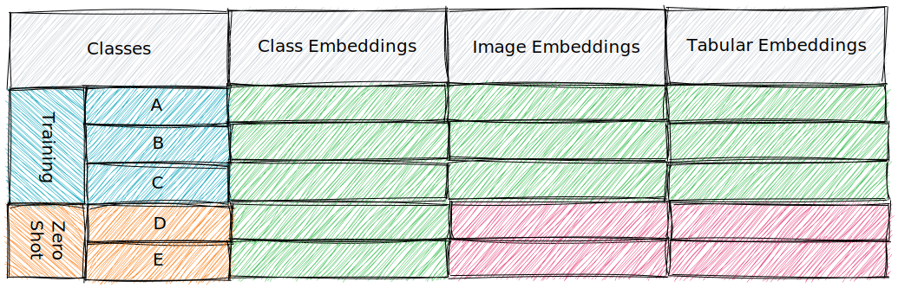

# Zero-Shot Learning (ZSL) Classification

## Installation Guide

## Approach

Figure 1: Training and ZSL properties per embedding type.

### Image Data
When implementing a ZSL classifier, using two feature embeddings, namely image and class embeddings, can enhance the model's performance and enable it to generalize to unseen classes.

By combining these two embedding techniques in the ZSL classifier, you can leverage both visual and semantic information to achieve better generalization to unseen classes.
The image embeddings capture the visual features and patterns, while the class embeddings provide semantic context and similarities between classes, allowing the model to make predictions on classes it has never seen before.

#### Image Embedding
Image embedding capture the visual characteristics and representations of images. 
The [VGG16](https://arxiv.org/pdf/1409.1556.pdf) CNN is a popular pre-trained convolutional neural network (CNN) architecture commonly used for image feature extraction.
By passing an image through the VGG16 CNN, we can obtain a high-dimensional embedding that encodes various visual features of the image.

##### When?
We use it when access to image data is possible with the aim to leverage the visual information for classification.
It is especially useful when the images contain discriminative visual cues that may help distinguish different classes.

##### Why?
It provides a rich representation of visual features, allowing the model to learn discriminative patterns directly from the image data.
It captures low-level features, such as edges and textures, as well as higher-level features, such as shapes and objects, that aid in the classification.
By incorporating image embeddings, the ZSL classifier can exploit the visual similarities between seen and unseen classes during training and make predictions based on these visual features during inference.

#### Class Embedding
Class embeddings capture the semantic information or textual representation associated with each class label.
[Word2Vec](https://radimrehurek.com/gensim/models/word2vec.html) is a popular algorithm used to generate word embeddings based on the distributional properties of words in a text corpus.

By incorporating class embeddings, the ZSL classifier cab exokiut the semantic similarities and relationships between seen and unseen classes.

##### When?
It is used when textual or semantic information is available for the classes. These embeddings are particularly useful in ZSL scenario's where you'd want to generalize to unseen classes that are not present in the training data.
By leveraging the semantic information, the model can learn to associate visual features with class embeddings, enabling ti to recognize and classify unseen classes.

##### Why?
It captures the semantic similarities between classes, even if they are visually dissimilar. 
By incorporating class embeddings, the ZSL classifier can bridge the gap between seen and unseen classes by levaraging the semantic relationships encoded in the embeddings.
It allows the model to transfer knowledge learned from seen classes to recognize and classify unseen classed based on their semantic representation.

### Tabular Data

## References
